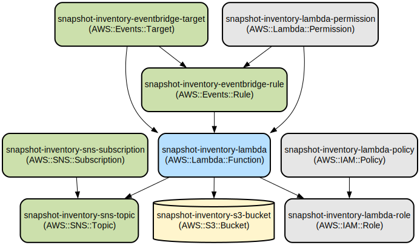

# AWS Snapshot Inventory Generator

This project automates the process of generating and reporting AWS snapshot inventories across multiple services.

The AWS Snapshot Inventory Generator is a serverless application that creates comprehensive reports of snapshots from various AWS services, including EC2, RDS, and EFS. It calculates snapshot ages, categorizes them, and generates both detailed CSV reports and summary notifications. This tool is designed to help AWS administrators and DevOps teams maintain better visibility and control over their snapshot resources.

The application is built using AWS Lambda and is deployed using Terraform. It leverages several AWS services, including S3 for report storage, SNS for notifications, and EventBridge for scheduling. The solution is designed to be easily deployable and configurable across different environments.

## Repository Structure

```
.
├── cleanup.sh
├── deploy.sh
├── requirements-lambda.txt
├── src
│   └── lambda_function.py
├── terraform
│   ├── data.tf
│   ├── eventbridge.tf
│   ├── iam.tf
│   ├── lambda.tf
│   ├── outputs.tf
│   ├── providers.tf
│   ├── s3.tf
│   ├── sns.tf
│   └── variables.tf
└── test_snapshot_inventory.py
```

### Key Files:
- `src/lambda_function.py`: The main Lambda function that generates the snapshot inventory.
- `deploy.sh`: Script for deploying the application.
- `cleanup.sh`: Script for cleaning up resources.
- `terraform/`: Directory containing Terraform configuration files for infrastructure provisioning.
- `test_snapshot_inventory.py`: Test suite for verifying the deployment of the Lambda function, S3 bucket, and SNS topic. It includes tests for Lambda function configuration, S3 bucket configuration, IAM role permissions, SNS topic configuration, Lambda function invocation, and deployment rollback capability.

## Usage Instructions

### Installation

Prerequisites:
- AWS CLI (version 2.0 or later)
- Terraform (version 1.0 or later)
- Python 3.9 or later
- go-aws-sso (for AWS Single Sign-On authentication)

Steps:
1. Clone the repository:
   ```
   git clone <repository-url>
   cd aws-snapshot-inventory-generator
   ```

2. Install Python dependencies:
   ```
   pip install -r requirements-lambda.txt
   ```

### Deployment

Before deploying the application, you must configure the required variables in `terraform/terraform.tfvars`:

```hcl
aws_region         = "us-east-1"          # AWS region for deployment
environment        = "nonprod"            # Environment name (nonprod or prod)
bucket_name        = "XXXXXXXXXXXXXXXXXX" # Unique S3 bucket name
product           = "Opsbank2"  # Product name for resource tagging
notification_email = "admin@example.com"  # Email for receiving notifications
tags = {
  Project   = "Snapshot-Inventory"
  ManagedBy = "Terraform"
}
```

To deploy the application:

1. Configure your AWS credentials:
   ```
   aws configure
   ```
   
   If using AWS SSO, use go-aws-sso to authenticate:
   ```
   go-aws-sso login
   ```

2. Run the deployment script:
   ```
   ./deploy.sh -e nonprod -f  //full deployment to a nonprod environment
   ```
   ```
   ./deploy.sh -e nonprod -l  //update lambda only in the nonprod environment
   ```

   Options:
   - `-e, --environment`: Specify the environment (nonprod or prod)
   - `-f, --full`: Perform a full deployment
   - `-l, --lambda`: Perform an update to the lambda function only. Leaaving infrastructure untouched

### Configuration

The application can be configured through environment variables and Terraform variables. Key configurations include:

- `S3_BUCKET_NAME`: Name of the S3 bucket for storing reports
- `SNS_TOPIC_ARN`: ARN of the SNS topic for notifications

These can be set in the `terraform/variables.tf` file or overridden during deployment.

### Testing

To run the unit tests:

```
python -m unittest test_snapshot_inventory.py
```

### Troubleshooting

Common issues:

1. Deployment Failure
   - Error: "NoSuchBucket: The specified bucket does not exist"
   - Solution: Ensure the S3 bucket name is unique and correctly specified in your Terraform configuration.

2. Lambda Function Timeout
   - Error: "Task timed out after 300 seconds"
   - Solution: The Lambda function has a default timeout of 300 seconds. If you're processing a large number of snapshots, consider optimizing the code or increasing the timeout in `terraform/lambda.tf`.

3. Insufficient Permissions
   - Error: "AccessDenied: User is not authorized to perform: ..."
   - Solution: Review and update the IAM roles in `terraform/iam.tf` to ensure necessary permissions are granted.

Debugging:
- Enable verbose logging in the Lambda function by setting the `LOG_LEVEL` environment variable to `DEBUG`.
- Check CloudWatch Logs for detailed error messages and stack traces.

## Data Flow

The AWS Snapshot Inventory Generator processes data through the following steps:

1. EventBridge triggers the Lambda function on a scheduled basis.
2. The Lambda function queries EC2, RDS, and EFS services for snapshot information.
3. Snapshot data is processed, categorized, and summarized.
4. A detailed CSV report is generated and uploaded to the specified S3 bucket.
5. A summary report is created and sent as a notification via SNS.

```
[EventBridge] -> [Lambda Function] -> [EC2/RDS/EFS APIs]
                                   -> [Process Data]
                                   -> [Generate Reports]
                                   -> [S3 Bucket]
                                   -> [SNS Topic]
```

Note: Ensure that the Lambda function has appropriate permissions to access the required AWS services and resources.

## Sample Output

The report includes:
- Total snapshot count across all services
- Breakdown by snapshot type (EBS, RDS, EFS)
- Age distribution of snapshots
- Storage consumption metrics
- Detailed CSV export for further analysis

## Source Code Generation

The source code for this project was initially generated using Amazon Q, an AI-powered assistant for software development. However, it's important to note that the generated code has undergone human review and modifications to ensure its quality, security, and alignment with specific project requirements.

While Amazon Q provided a strong foundation for the project structure and core functionality, human expertise was applied to:
- Refine and optimize the code
- Ensure best practices and coding standards are followed
- Implement additional features and customizations
- Verify and enhance security measures
- Adapt the code to specific use cases and requirements

This combination of AI-generated code and human expertise allows for rapid development while maintaining high-quality, tailored solutions.

## Infrastructure



The project uses Terraform to define and manage the following AWS resources:

- Lambda:
  - `aws_lambda_function`: The main Lambda function for generating snapshot inventories.
- IAM:
  - `aws_iam_role`: IAM role for the Lambda function with permissions for:
    - EC2: Describe snapshots and volumes
    - RDS: Describe DB snapshots
    - AWS Backup: List and describe backup jobs
    - S3: Put objects
    - SNS: Publish messages
    - CloudWatch: Create log groups, streams, and put log events
- S3:
  - `aws_s3_bucket`: Bucket for storing snapshot inventory reports.
- SNS:
  - `aws_sns_topic`: Topic for sending notifications about generated reports.
- EventBridge:
  - `aws_cloudwatch_event_rule`: Rule for scheduling the Lambda function execution.
  - `aws_cloudwatch_event_target`: Target linking the EventBridge rule to the Lambda function.

These resources are defined in the respective Terraform files within the `terraform/` directory.